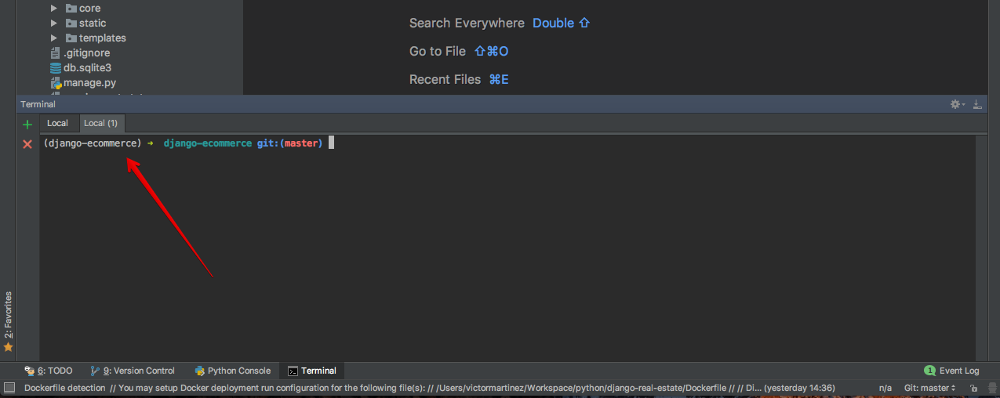

PyCharm is my favorite IDE and undoubtedly a powerful tool. It gives you great shortcuts and a set of tools that prevent the programmer from dealing with many windows. One of them is the built-in terminal that increase our productivity once it is not necessary to shift from the IDE to the terminal and vice versa.

As you can see in the image below the terminal inside PyCharm shows the current virtualenv I am working with.

However, you might get some errors at first if your local environment is not set up properly. Once I use [Pyenv](https://github.com/pyenv/pyenv) to manage my python versions and _virtualenvs_ I had to set up the environment in order to have the terminal integrated with PyCharm. It is quite easy:

1. Go to Preferences > Project Interpreter
1. Click on the gear and select **Add local**
1. Point to the python file inside your virtualenv. Once I am using pyenv, the path is `~/.pyenv/versions/<virtualenv-name>/bin/python3`
1. You might need to restart your PyCharm.

##### Don't you use Pyenv?

~~Install it and follow the tutorial~~. You just need to replace the path by your virtualenv path.
